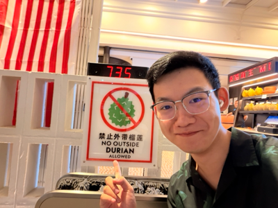
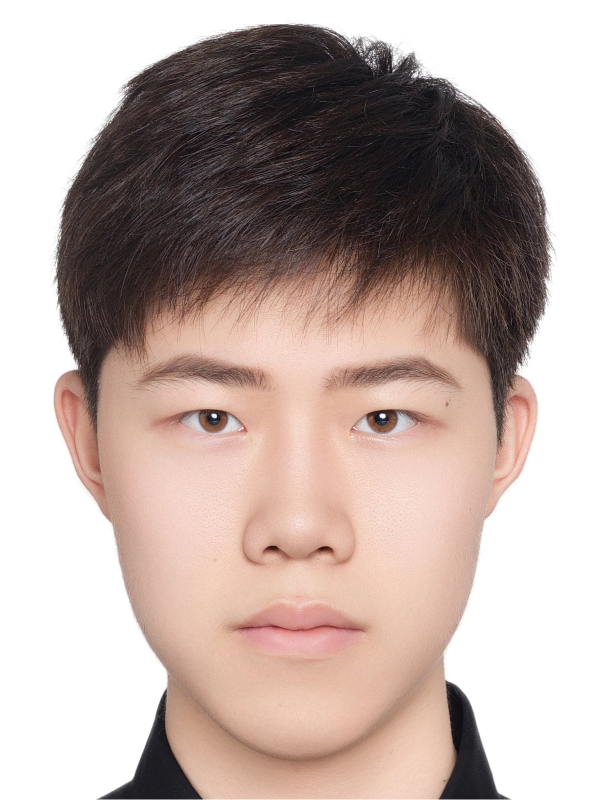
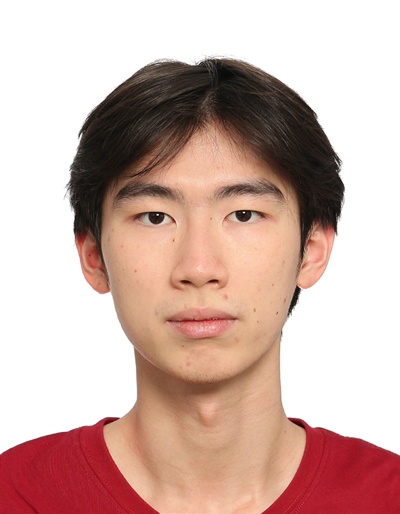

We are a team based in the [School of Computing, National University of Singapore](https://www.comp.nus.edu.sg).

You can reach us at the email `seer[at]comp.nus.edu.sg`

## Project team

### Ma Mingyang (Marcus)

[[github](https://github.com/MarcusMa06-code)]
[[portfolio](team/marcusma06-code.md)]

* Role: Developer
* Responsibilities: Developing

### Lin Ziyang

[[github](https://github.com/linziyang2025-byte)]

* Role: Developer

### Zheng Yuxiao

[[github](http://github.com/enchantedcolesaw)]

* Role: Debugger 2
* Responsibilities: Debug

### Lim En Xi

[[github](https://github.com/limenxi07)]

* Role: Testing
* Responsibilities: Ensure testing is done properly and on time

### Jean Doe

[[github](http://github.com/johndoe)]
[[portfolio](team/johndoe.md)]

* Role: Developer
* Responsibilities: Dev Ops + Threading

### James Doe

[[github](http://github.com/johndoe)]
[[portfolio](team/johndoe.md)]

* Role: Developer
* Responsibilities: UI
