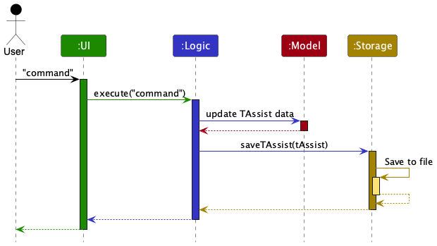
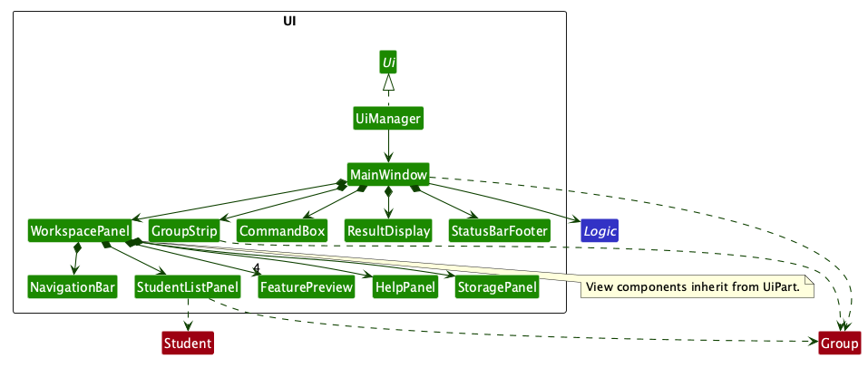
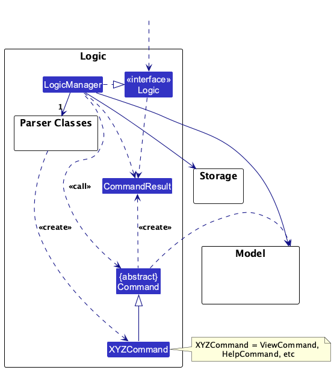
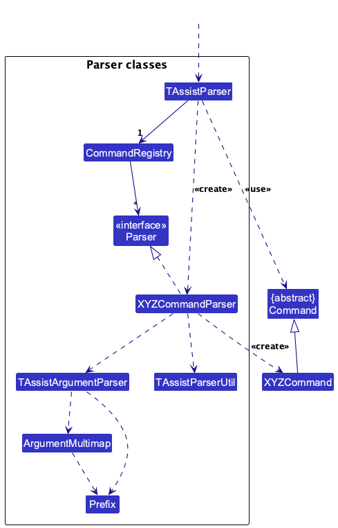
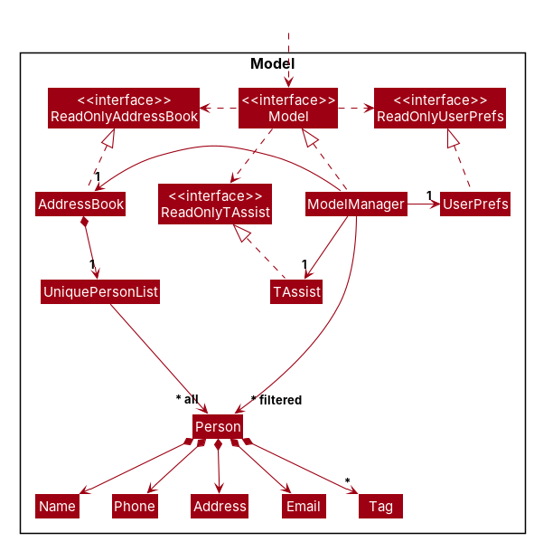
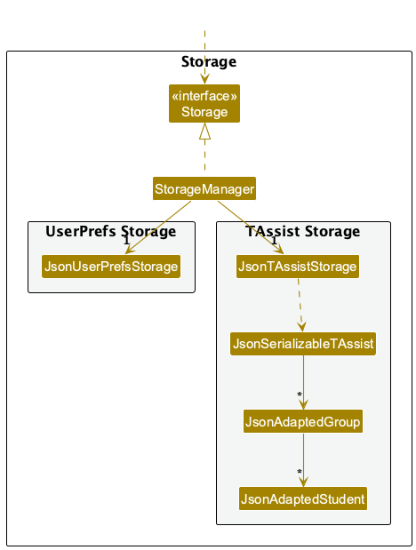
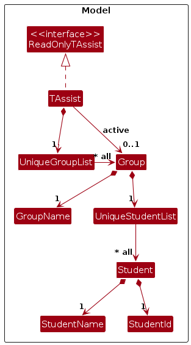
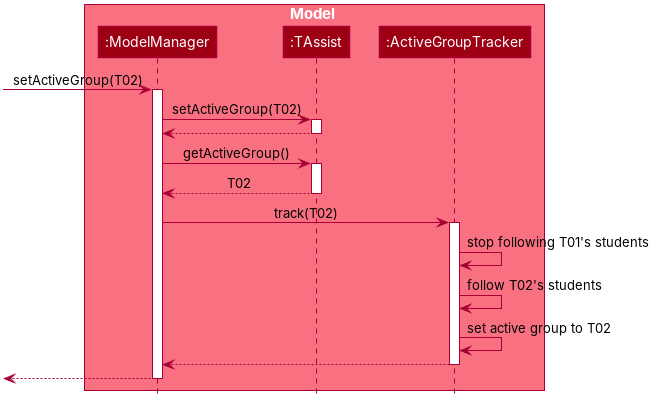

* Table of Contents
{:toc}

--------------------------------------------------------------------------------------------------------------------

## **Acknowledgements**

* The GUI is based on the team-supplied **TAssist UI Mockups.html** design reference: its colors, cards and
  command-first layout. A single light top bar and a navigation bar replace the dark header and the tab strip of the
  mockup. It is implemented with native JavaFX controls; no HTML runtime, web fonts, or additional libraries are
  bundled.

--------------------------------------------------------------------------------------------------------------------

## **Setting up, getting started**

Refer to the guide [_Setting up and getting started_](SettingUp.md).

--------------------------------------------------------------------------------------------------------------------

## **Design**

<div markdown="span" class="alert alert-primary">

:bulb: **Tip:** The `.puml` files used to create diagrams are in `docs/diagrams`. Refer to the [_PlantUML Tutorial_ at se-edu/guides](https://se-education.org/guides/tutorials/plantUml.html) to learn how to create and edit diagrams.
</div>

### Architecture


The ***Architecture Diagram*** given above explains the high-level design of the App.

The following provides a quick overview of the main components and their interactions.

**Main components of the architecture**

**`Main`** (consisting of classes [`Main`](https://github.com/se-edu/addressbook-level3/tree/master/src/main/java/seedu/address/Main.java) and [`MainApp`](https://github.com/se-edu/addressbook-level3/tree/master/src/main/java/seedu/address/MainApp.java)) is in charge of the app launch and shut down.
* At app launch, it initializes the other components in the correct sequence, and connects them up with each other.
* At shut down, it shuts down the other components and invokes cleanup methods where necessary.

The bulk of the app's work is done by the following four components:

* [**`UI`**](#ui-component): The UI of the App.
* [**`Logic`**](#logic-component): The command executor.
* [**`Model`**](#model-component): Holds the data of the App in memory.
* [**`Storage`**](#storage-component): Reads data from, and writes data to, the hard disk.

[**`Commons`**](#common-classes) represents a collection of classes used by multiple other components.

**How the architecture components interact with each other**

The *Sequence Diagram* below shows how the components interact with each other for the scenario where the user issues the command `delete 1`.



Each of the four main components (also shown in the diagram above),

* defines its *API* in an `interface` with the same name as the Component.
* provides its functionality through a concrete `{Component Name}Manager` class that implements the corresponding API interface.

For example, the `Logic` component defines its API in `Logic.java` and implements it in `LogicManager.java`. Other components interact with a component through its interface rather than its concrete class, preventing them from coupling to that component's implementation, as illustrated in the following partial class diagram.


The sections below give more details of each component.

### UI component

The **API** of this component is specified in [`Ui.java`](https://github.com/se-edu/addressbook-level3/tree/master/src/main/java/seedu/address/ui/Ui.java)



The UI consists of `MainWindow`, `GroupStrip`, `NavigationBar`, `WorkspacePanel`, `CommandBox`, `ResultDisplay`, and
`StatusBarFooter`. `MainWindow` places the `GroupStrip` and the `NavigationBar` in one light bar at the top.
`WorkspacePanel` hosts the live `StudentListPanel` table, `HelpPanel`, `StoragePanel`, and four `FeaturePreview` panels.
Its tab strip is hidden: it only holds the screens, and `NavigationBar` selects them. Each button of the bar does what
`view SCREEN` does, shows that command in its tooltip, and does not take keyboard focus away from the command box, so
the UI stays usable by mouse while the app remains command-first.
All inherit from `UiPart`, which loads their FXML. `TAssist.css` defines the shared visual style and compact layout.

The `GroupStrip` and the Students screen (`StudentListPanel`) observe the
views that `Logic` provides: `getGroupList()`, `activeGroupProperty()` and `getActiveGroupStudentList()` (see
[Observing the active group](#observing-the-active-group)). They never keep their own copy of the data, so a change to
the groups, the active group or its students shows at once. The card of the Students screen is titled with the active
group's name, and says "No active group" when none is active. When there are no students, an explanation replaces the
table, and says whether no group is active or the active group has no students yet. Columns cannot be sorted or reordered, a list change refreshes the row numbers,
and long values are shortened with an ellipsis and shown in full in a tooltip.

`view SCREEN` follows the normal command/parser pattern and returns a `WorkspaceView` in `CommandResult`.
`MainWindow` selects the corresponding screen. `LogicManager` skips persistence for navigation results; switching
screens does not change the model or filter. Other successful commands save TAssist data through `Storage` and keep
the current screen, so contact commands, which are not saved, do not jump to the Students screen where contacts are no
longer shown.

The command reference is shown only on the Help screen. `help` returns `CommandResult.forHelp(...)` with a one-line
confirmation and, for `help TOPIC`, the topic. `MainWindow` then asks `WorkspacePanel` to open Help, which scrolls
`HelpPanel` to that topic's heading. F1, the Help button of the `NavigationBar` and `view help` open the same screen.

`ResultDisplay` sizes itself to the message: it measures how many lines the text wraps to at the current width and
shows that many rows, from one up to six. Longer messages scroll. It shows a check mark beside a message, or a cross on
a red row when the command failed, and failed commands retain their input.

The four feature previews deliberately contain no records and are marked **Coming soon**. They are UI layouts only;
future increments must connect domain models, commands and persistence before enabling their controls.

The `UI` component uses the JavaFX UI framework. The layouts of these UI parts are defined in matching `.fxml` files in `src/main/resources/view`. For example, [`MainWindow.fxml`](https://github.com/se-edu/addressbook-level3/tree/master/src/main/resources/view/MainWindow.fxml) specifies the layout of [`MainWindow`](https://github.com/se-edu/addressbook-level3/tree/master/src/main/java/seedu/address/ui/MainWindow.java).

The `UI` component,

* executes user commands using the `Logic` component.
* listens for changes to `Model` data so that the UI can be updated with the modified data.
* keeps a reference to the `Logic` component, because the `UI` relies on the `Logic` to execute commands.
* depends on some classes in the `Model` component because it displays `Group` and `Student` objects from the model.

### Logic component

**API** : [`Logic.java`](https://github.com/se-edu/addressbook-level3/tree/master/src/main/java/seedu/address/logic/Logic.java)

Here's a (partial) class diagram of the `Logic` component:



The sequence diagram below illustrates the interactions within the `Logic` component, taking `execute("delete 1")` API call as an example.


<div markdown="span" class="alert alert-info">:information_source: **Note:** The lifeline for `DeleteCommandParser` should end at the destroy marker (X), but due to a limitation of PlantUML, it continues to the end of the diagram.
</div>

How the `Logic` component works:

1. When `Logic` is called upon to execute a command, the command is passed to an `AddressBookParser` object, which in turn creates a parser that matches the command (e.g., `DeleteCommandParser`) and uses it to parse the command.
1. This results in a `Command` object (more precisely, an object of one of its subclasses e.g., `DeleteCommand`) which is executed by the `LogicManager`.
1. The command can communicate with the `Model` when it is executed (e.g. to delete a person).<br>
   Note that although this is shown as a single step in the diagram above for simplicity, the code can require several interactions between the command object and the `Model` to complete the operation.
1. The result of the command execution is encapsulated as a `CommandResult` object which is returned from `Logic`.

Here are the other classes in `Logic` (omitted from the class diagram above) that are used for parsing a user command:



How the parsing works:
* When called upon to parse a user command, the `AddressBookParser` class creates an `XYZCommandParser` (`XYZ` is a placeholder for the specific command name, e.g., `AddCommandParser`). The parser uses the other classes shown above to parse the user command and create an `XYZCommand` object (e.g., `AddCommand`). The `AddressBookParser` returns that object as a `Command` object.
* All `XYZCommandParser` classes, such as `AddCommandParser` and `DeleteCommandParser`, implement the `Parser` interface so they can be treated similarly where appropriate, for example during testing.

### Model component
**API** : [`Model.java`](https://github.com/se-edu/addressbook-level3/tree/master/src/main/java/seedu/address/model/Model.java)




The `Model` component,

* stores the address book data i.e., all `Person` objects (which are contained in a `UniquePersonList` object).
* stores the TAssist data, i.e., the tutorial groups, their students and the active group, in a `TAssist` object (see [TAssist domain model](#tassist-domain-model)). It exposes the active group and the active group's students as observable values that the UI can bind to (see [Observing the active group](#observing-the-active-group)).
* stores the `Person` objects selected by the current filter, such as search results, in a separate _filtered_ list. It exposes this list as an unmodifiable `ObservableList<Person>` that the UI can observe and bind to, so the UI updates when the list changes.
* stores a `UserPrefs` object that represents the user’s preferences (currently, just the GUI settings). This is exposed to the outside as a `ReadOnlyUserPrefs` object.
* does not depend on any of the other three components (as the `Model` represents data entities of the domain, they should make sense on their own without depending on other components)

<div markdown="span" class="alert alert-info">:information_source: **Note:** The alternative, arguably more object-oriented, design below keeps a unique list of tags in `AddressBook`, and each `Person` references tags from that list. This lets `AddressBook` maintain one `Tag` object per unique tag instead of each `Person` holding its own `Tag` objects.<br>


</div>


### Storage component

**API** : [`Storage.java`](https://github.com/se-edu/addressbook-level3/tree/master/src/main/java/seedu/address/storage/Storage.java)



The `Storage` component,
* can save both TAssist data and user preference data in JSON format, and read them back into corresponding objects.
* is implemented by `StorageManager`, which delegates the actual JSON file access to `JsonTAssistStorage` and `JsonUserPrefsStorage` (one class per data file).
* converts TAssist data to and from JSON through one Jackson-friendly class per model class: `JsonSerializableTAssist` for `TAssist`, `JsonAdaptedGroup` for `Group` and `JsonAdaptedStudent` for `Student` (see [Saving and loading TAssist data](#saving-and-loading-tassist-data)).
* depends on some classes in the `Model` component (because the `Storage` component's job is to save/retrieve objects that belong to the `Model`)

AddressBook data is no longer read or saved. Its storage classes (`JsonAddressBookStorage` and the classes it uses) remain in the code base until the AddressBook code is removed.

### Common classes

Classes used by multiple components are in the `seedu.address.commons` package.

--------------------------------------------------------------------------------------------------------------------

## **Implementation**

This section describes some noteworthy details on how certain features are implemented.

### Command registration and shared validation

`CommandRegistry` maps a feature keyword and subcommand to a `Parser<? extends Command>` and its `HelpEntry`.
Each feature owns its parser, format, description, and examples, so adding a command does not require editing another
feature's help content or adding a case to the legacy command switch. Register commands before creating `LogicManager`:

```java
CommandRegistry registry = new CommandRegistry();
registry.register("group", "add", new GroupAddCommandParser(),
        new HelpEntry("group", "group add n/NAME", "Add a student group.", List.of("group add n/Tutorial 1")));
Logic logic = new LogicManager(model, storage, registry);
```

This example shows how future feature parsers and help text are connected; those feature commands are not yet
implemented.

* `AddressBookParser` and `LogicManager` take snapshots of registrations at construction. Later changes to the source
  registry do not change the running parser or its help.
* A feature keyword cannot shadow an existing legacy command. Duplicate registrations and invalid registration
  keywords are developer errors and throw `IllegalArgumentException`.

#### In-app help

* Existing AB3 commands and `view` keep their built-in `HelpEntry` objects in `HelpCatalog`. `AddressBookParser` combines
  them with the registered feature entries, and `Logic#getHelpEntries()` exposes the combined list.
* `HelpCommandParser` accepts an optional topic. `HelpCatalog.TOPICS` lists the valid topics, and an unknown topic
  throws a `ParseException` with the message required for unknown topics. A feature's `HelpEntry` topic must equal
  its feature keyword, so a feature appears under `help TOPIC` only if its keyword is listed in `HelpCatalog.TOPICS`.
* `HelpCommand` formats the entries (or only those of the requested topic) with `HelpCatalog.format` and returns them
  as the feedback of its `CommandResult`, so `MainWindow` only displays the result and opens the Help screen.
* The Help screen (`HelpPanel`) renders the same entries and uses `HelpCatalog.getTopicHeading` for its headings.

For registered commands, `AddressBookParser` extracts the first keyword and lets `CommandRegistry` extract
the subcommand. The registered parser receives only the remaining arguments. Missing and unknown subcommands
produce distinct `ParseException` messages listing the registered subcommands in alphabetical order.
Unknown feature keywords report an unknown command. Both keywords use lowercase letters; surrounding whitespace
and repeated whitespace between keywords are ignored. Argument values retain their capitalization and spacing
until their value validator normalizes them.

Feature parsers declare their required and optional parameters with `TAssistArgumentParser`:

```java
TAssistArgumentParser arguments = new TAssistArgumentParser(
        List.of(PREFIX_NAME, PREFIX_ID), List.of());
ArgumentMultimap values = arguments.parse(args);
StudentName name = TAssistParserUtil.parseStudentName(values.getValue(PREFIX_NAME).orElseThrow());
StudentId id = TAssistParserUtil.parseStudentId(values.getValue(PREFIX_ID).orElseThrow());
```

Prefixes contain lowercase letters followed by `/`, and start at the beginning of arguments or after whitespace.
Prefix-like tokens at those boundaries are reserved for parameters. A slash embedded in a value does not separate
parameters, and URL schemes such as `https://` are retained as values. Parameters can appear in any order.
Unknown prefixes, repeated parameters, missing required parameters, and unexpected text before parameters
produce specific errors. Optional parameters may appear at most once. Empty values are retained for the value
validator to report a value error instead of a missing-parameter error. A command declaring no prefixes rejects
extra input. These checks do not change the legacy AB3 tokenization or repeated-tag behavior.

`TAssistParserUtil` reuses `StudentName`, `StudentId`, and `GroupName` validation and normalization.
It also validates assignment names (1–60 characters after whitespace normalization), weeks (whole numbers 1–13),
participation scores (whole numbers 0–5), and grades (whole numbers 0–100). Assignment names retain capitalization
and have no additional character restrictions. Numeric input is trimmed, accepts digits including leading zeros,
and rejects signs, decimals, out-of-range values, and integer overflow with a field-specific `ParseException`.

Parsers only validate and construct commands. `LogicManager` executes and saves after parsing succeeds;
parsing failures neither execute a command nor call storage. Registry, argument, and value-validator unit tests
cover these rules. `LogicManagerTest` also verifies that rejected feature input leaves the model and existing
data file unchanged, using a storage implementation that fails if saving is attempted.

### TAssist domain model

TAssist's own data is modelled by the classes below. `ModelManager` holds a `TAssist` beside the AddressBook data while the app moves over to TAssist, and the `Model` interface delegates group, active-group and student operations to it. TAssist data is saved to a JSON data file (see [Saving and loading TAssist data](#saving-and-loading-tassist-data)).



* `TAssist` is the root object. It holds the tutorial groups in a `UniqueGroupList` and remembers which group is active, if any. Other components see it through the read-only `ReadOnlyTAssist` interface.
* A `Group` has a `GroupName` and holds its own students in a `UniqueStudentList`.
* A `Student` has a `StudentName` and a `StudentId`, and is immutable.
* `UniqueGroupList` and `UniqueStudentList` share the uniqueness logic of the generic `UniqueList`, which also exposes the items as an unmodifiable `ObservableList` that the UI can bind to.

These classes follow the rules in our feature specification:

* **Group names** are compared case-insensitively, so `T01` and `t01` are the same group. The name is shown with the capitalization the TA typed.
* **Student IDs** are stored in uppercase, so they are compared case-insensitively. A student ID is unique *within a group* only, so the same student can be in two groups (e.g. for a make-up session). Two students may share a name if their IDs differ.
* **Spaces:** leading and trailing spaces are ignored, and repeated spaces inside group names and student names count as one space.
* **Active group:** the active group, if any, is always one of the groups held. Adding a group does not make it active by itself; commands decide when to switch.
* **Copies:** `new TAssist(data)` copies every group, so changing the copy never changes the original.

#### Where per-student records are stored

Attendance, participation scores and assignment results are not implemented yet. When they are, they will be stored **on the `Student` object, inside the group the student belongs to**:

* **Weekly records** (attendance and participation): each `Student` will hold one week-keyed record per kind, e.g. a mapping from `Week` to `AttendanceStatus`. Both kinds will use one shared weekly record mechanism, so the attendance and participation features only add their own value types and messages.
* **Assignments:** a `Group` will hold the list of assignments created for it, since assignment names are unique within a group. Each `Student` will hold their own submission status and grade for each assignment, keyed by assignment name.
* As `Student` is immutable, recording or updating a value will replace the student in its group with an updated copy.

**Aspect: Where per-student records are stored**

* **Alternative 1 (current choice):** Store the records on each `Student`, inside its group.
  * Pros: A student's records are automatically scoped to the right group, which matters because student IDs are only unique within a group. Removing a student also removes all of their records, so no record can point to a student who no longer exists. The data file nests group → students → records, which is easy to read and edit by hand, and each feature adds its own field without changing the others.
  * Cons: `Student` grows a field for each kind of record, and every update creates a new `Student` object.

* **Alternative 2:** Keep separate tables in each `Group`, keyed by student ID (e.g. one attendance table, one participation table).
  * Pros: `Student` stays small, and each feature owns its own table.
  * Cons: Removing a student must also clean up every table, and a wrong manual edit of the data file can leave records for a student who does not exist.

* **Alternative 3:** Keep one list of records for the whole app, keyed by group, student ID and week.
  * Pros: All records are in one place.
  * Cons: Every lookup has to filter by group and student, and the data file is the hardest of the three to read and edit by hand.

#### Observing the active group

The UI shows the active group and its students, and must update when either changes. `Model` and `Logic` provide two observable views for this:

* `activeGroupProperty()` holds the active group, or an empty `Optional` when no group is active.
* `getActiveGroupStudentList()` is an unmodifiable `ObservableList` of the active group's students. It is empty when no group is active.

Both views are kept by `ActiveGroupTracker`, a helper class inside the `Model` component. The student list *follows* the active group: it listens to the active group's own student list, so adding or removing a student in that group shows at once. Whenever the active group may have changed (`setActiveGroup` or `setTAssist`), `ModelManager` asks the tracker to track the new active group. The tracker stops listening to the old group, copies the new group's students into the list it exposes, and then updates the active group. The sequence diagram below shows this for `setActiveGroup`.



`setTAssist` replaces every group with a copy, so the tracker is pointed at the copy of the active group even when the active group's name stays the same. Changes to a group that is no longer active do not show in the list.

`activeGroupProperty()` compares groups by value, so it does not notify when the active group is replaced by an equal one, for example when `setTAssist` loads the same data. Bind to `getActiveGroupStudentList()` for the students, and do not keep a `Group` taken from the property, as it may be replaced by an equal copy without notice.

**Aspect: How the UI follows the active group's students**

* **Alternative 1 (current choice):** `Model` exposes one student list that follows the active group.
  * Pros: The UI binds once and never needs to know which group is active. Listener bookkeeping is in one small class that is easy to unit test without the UI.
  * Cons: The list holds a copy of the active group's students, which is refreshed after each change (cheap for a tutorial group of about 20 students).

* **Alternative 2:** The UI listens to the active group and rebinds its table to the new group's own student list.
  * Pros: No copy of the students is kept.
  * Cons: Every UI part that shows students must repeat the rebinding logic, and the UI must remember to stop listening to the old group.

* **Alternative 3:** Keep one list of all students and filter it by the active group, like AB3's filtered person list.
  * Pros: Reuses the familiar `FilteredList` pattern.
  * Cons: Students belong to a group in our model, and a student ID is only unique within a group. A flat list of all students would have to be rebuilt whenever any group changes.

### Saving and loading TAssist data

TAssist data is kept in one human-editable JSON file, `data/tassist.json`. The file nests the data the same way as the model: the active group's name, then each group with its students.

```json
{
  "activeGroup" : "T01",
  "groups" : [ {
    "name" : "T01",
    "students" : [ {
      "name" : "Alice Tan",
      "studentId" : "A0123456X"
    } ]
  } ]
}
```

**Saving.** After a command succeeds, `LogicManager` calls `Storage#saveTAssist(model.getTAssist())`, unless the command only opens a screen (`view`). `JsonSerializableTAssist` copies the groups and the active group's name into Jackson-friendly objects, which `JsonUtil` writes to the file. A failed command throws before this point, so it never saves.

**Loading.** At startup, `MainApp#initModelManager` calls `Storage#readTAssist()`:

* If the file does not exist, the app starts with an empty `TAssist` and no sample data. The file is created by the first save.
* If the file cannot be read, is not valid JSON, or holds invalid data, `JsonTAssistStorage` throws a `DataLoadingException`. `MainApp` logs the reason as a warning and starts with an empty `TAssist`, so a wrong manual edit never crashes the app.
* Otherwise, `JsonSerializableTAssist#toModelType()` rebuilds the `TAssist` with the model's own constructors, so values are checked and normalized as if the TA had typed them.

`toModelType()` rejects, with a message naming the problem, a missing or invalid group name, student name or student ID, an empty entry in a list, two groups with the same name (ignoring case), two students with the same ID in one group, and an active group that is not one of the groups. To keep manual editing forgiving, a missing `groups` or `students` list is read as an empty list, a missing or `null` `activeGroup` means no group is active, and unknown fields are ignored.

**Adding records in later features.** Each Jackson-friendly class mirrors one model class and only converts its own fields. A feature that stores more data adds a field to the class that mirrors where its data lives in the model (see [Where per-student records are stored](#where-per-student-records-are-stored)):

* Weekly records sit on each student, so the shared weekly record mechanism adds one field per kind of record to `JsonAdaptedStudent`, e.g. `"attendance" : { "1" : "PRESENT" }`, converted by its own adapter class.
* Assignments sit on each group, so the assignment feature adds an `assignments` field to `JsonAdaptedGroup`.

A file saved before a feature existed has no field for it, so the feature should read a missing field as "no records". Other features' fields and `JsonSerializableTAssist` do not change.

**Aspect: How TAssist data is laid out in the file**

* **Alternative 1 (current choice):** One file that nests group → students → records, mirroring the model.
  * Pros: Easy to read and edit by hand, since everything about a student is in one place. Each feature adds its own field without changing the others, and removing a student from the file also removes their records.
  * Cons: The whole file is rewritten on every save, which is cheap for a TA's few groups of about 20 students.

* **Alternative 2:** One file per feature (e.g. `groups.json`, `attendance.json`), linked by group name and student ID.
  * Pros: Each feature owns its file.
  * Cons: A manual edit to one file, such as renaming a group, can leave records in another file that point to nothing. Loading must check every file against the others.

### \[Proposed\] Undo/redo feature

#### Proposed Implementation

The proposed undo/redo mechanism is facilitated by `VersionedAddressBook`. It extends `AddressBook` with an undo/redo history, stored internally as an `addressBookStateList` and `currentStatePointer`. Additionally, it implements the following operations:

* `VersionedAddressBook#commit()` — Saves the current address book state in its history.
* `VersionedAddressBook#undo()` — Restores the previous address book state from its history.
* `VersionedAddressBook#redo()` — Restores a previously undone address book state from its history.

These operations are exposed in the `Model` interface as `Model#commitAddressBook()`, `Model#undoAddressBook()` and `Model#redoAddressBook()` respectively.

Given below is an example usage scenario and how the undo/redo mechanism behaves at each step.

Step 1. The user launches the application for the first time. The `VersionedAddressBook` will be initialized with the initial address book state, and the `currentStatePointer` pointing to that single address book state.


Step 2. The user executes `delete 5` command to delete the 5th person in the address book. The `delete` command calls `Model#commitAddressBook()`, causing the modified state of the address book after the `delete 5` command executes to be saved in the `addressBookStateList`, and the `currentStatePointer` is shifted to the newly inserted address book state.


Step 3. The user executes `add n/David …​` to add a new person. The `add` command also calls `Model#commitAddressBook()`, causing another modified address book state to be saved into the `addressBookStateList`.


<div markdown="span" class="alert alert-info">:information_source: **Note:** If a command fails its execution, it will not call `Model#commitAddressBook()`, so the address book state will not be saved into the `addressBookStateList`.

</div>

Step 4. The user now decides that adding the person was a mistake, and decides to undo that action by executing the `undo` command. The `undo` command will call `Model#undoAddressBook()`, which will shift the `currentStatePointer` once to the left, pointing it to the previous address book state, and restores the address book to that state.


<div markdown="span" class="alert alert-info">:information_source: **Note:** If the `currentStatePointer` is at index 0, pointing to the initial AddressBook state, then there are no previous AddressBook states to restore. The `undo` command uses `Model#canUndoAddressBook()` to check if this is the case. If so, it will return an error to the user rather
than attempting to perform the undo.

</div>

The following sequence diagram shows how an undo operation goes through the `Logic` component:


<div markdown="span" class="alert alert-info">:information_source: **Note:** The lifeline for `UndoCommand` should end at the destroy marker (X), but due to a limitation of PlantUML, it continues to the end of the diagram.

</div>

Similarly, how an undo operation goes through the `Model` component is shown below:


The `redo` command does the opposite — it calls `Model#redoAddressBook()`, which shifts the `currentStatePointer` once to the right, pointing to the previously undone state, and restores the address book to that state.

<div markdown="span" class="alert alert-info">:information_source: **Note:** If the `currentStatePointer` is at index `addressBookStateList.size() - 1`, pointing to the latest address book state, then there are no undone AddressBook states to restore. The `redo` command uses `Model#canRedoAddressBook()` to check if this is the case. If so, it will return an error to the user rather than attempting to perform the redo.

</div>

Step 5. The user then decides to execute the command `list`. Commands that do not modify the address book, such as `list`, will usually not call `Model#commitAddressBook()`, `Model#undoAddressBook()` or `Model#redoAddressBook()`. Thus, the `addressBookStateList` remains unchanged.


Step 6. The user executes `clear`, which calls `Model#commitAddressBook()`. Since the `currentStatePointer` is not pointing at the end of the `addressBookStateList`, all address book states after the `currentStatePointer` will be purged. Reason: It no longer makes sense to redo the `add n/David …​` command. This is the behavior that most modern desktop applications follow.


The following activity diagram summarizes what happens when a user executes a new command:


#### Design considerations:

**Aspect: How undo & redo execute:**

* **Alternative 1 (current choice):** Saves the entire address book.
  * Pros: Easy to implement.
  * Cons: May have performance issues in terms of memory usage.

* **Alternative 2:** Individual command knows how to undo/redo by
  itself.
  * Pros: Will use less memory (e.g. for `delete`, just save the person being deleted).
  * Cons: We must ensure that the implementation of each individual command is correct.

_{more aspects and alternatives to be added}_

### \[Proposed\] Data archiving

_{Explain here how the data archiving feature will be implemented}_


--------------------------------------------------------------------------------------------------------------------

## **Documentation, logging, testing, dev-ops**

* [Documentation guide](Documentation.md)
* [Testing guide](Testing.md)
* [Logging guide](Logging.md)
* [DevOps guide](DevOps.md)

--------------------------------------------------------------------------------------------------------------------

## **Appendix: Requirements**

### Product scope

**Target user profile**:

* is a teaching assistant (TA) for CS2040S who runs weekly tutorial sessions
* handles several tutorial groups of around 20 students each
* records tutorial attendance and class participation every week, and grades the problem sets submitted by each student
* works alone from their own laptop
* can type fast and prefers typing to mouse interactions
* is reasonably comfortable using CLI apps

**Value proposition**: Track each student's tutorial attendance, class participation scores, and assignment submissions across tutorial groups as fast as the TA can type, which saves the TA time compared to paper sheets or clicking through Canvas.


### User stories

Priority 1 = Must have in MVP, Priority 2 = Nice to have, Priority 3 = Stretch

| # | Priority | As a … | I can … | So that I can … |
| --- | --- | --- | --- | --- |
| 1 | P1 | new user | see usage instructions / a command list | refer to them when I forget how to use the app |
| 2 | P2 | new user | see the app populated with sample data | see what the app looks like when in use |
| 3 | P2 | new user | purge all sample data | get rid of the data I used for exploring |
| 4 | P3 | new user | see an example of the correct format when I mistype a command | fix my mistake without opening the help page |
| 5 | P3 | new user | go through a short guided setup | get my first group set up without reading a manual |
| 6 | P1 | TA | create a tutorial group | keep each of my groups' records separate |
| 7 | P1 | TA | add a student to a tutorial group | start tracking that student |
| 8 | P1 | TA | list all students in a group | see who I am teaching |
| 9 | P1 | TA | delete a student | remove someone who dropped the module |
| 10 | P1 | TA | switch between my tutorial groups | work on the group I am currently teaching |
| 11 | P2 | TA | import a student list from a CSV file | avoid typing 60 names by hand |
| 12 | P2 | TA | edit a student's details | fix a typo or update a changed name |
| 13 | P2 | TA | move a student from one group to another | handle students who switch tutorial slots |
| 14 | P3 | TA | record a private note, like a student’s preferred name or name pronunciation | address students the way they want in class |
| 15 | P3 | TA | attach a photo to a student | learn to recognise my students’ faces |
| 16 | P1 | TA | mark a student present or absent for a given week | keep a record of attendance |
| 17 | P1 | TA | view a tutorial group’s attendance for a given week | check I have not missed anyone before class ends |
| 18 | P1 | busy TA | correct an attendance mark I entered wrongly | keep my records accurate |
| 19 | P2 | TA | mark a student as late rather than absent | record partial attendance fairly |
| 20 | P2 | TA | record a reason for an absence | tell excused absences apart from unexcused ones |
| 21 | P3 | TA | mark the whole group present in one command | mark a full-attendance week in seconds |
| 22 | P3 | TA | see one student's attendance across the whole semester | answer individual students’ queries about their attendance |
| 23 | P1 | TA | give a student a participation score for a week | record who contributed in class |
| 24 | P1 | TA | change a participation score I already gave | correct myself after the session |
| 25 | P1 | TA | see the participation scores for a group in a week | check my marking is consistent across students |
| 26 | P2 | TA | award a participation point with a single short command | do it mid-discussion without losing my train of thought |
| 27 | P3 | TA | see each student's total participation score so far | know who is falling behind on participation |
| 28 | P3 | TA | see who has never participated | make a point of calling on them next week |
| 29 | P1 | TA | create an assignment for a group | start tracking it |
| 30 | P1 | TA | mark a student's assignment as submitted or not | track who handed in work |
| 31 | P1 | TA | record a grade for a student’s assignment | keep marks in one place |
| 32 | P2 | TA | see which students have not submitted an assignment | chase them before the deadline passes |
| 33 | P3 | TA | set a deadline for an assignment | tell late submissions from on-time ones |
| 34 | P3 | TA | mark a submission as late | apply the late penalty consistently |
| 35 | P2 | TA | find a student by name or student ID | pull up their record without scrolling |
| 36 | P2 | TA | see a single student's full record | answer a student's question about their standing |
| 37 | P1 | TA | have my data saved automatically | not lose a session's marks if the app closes |
| 38 | P1 | TA | have my data stored on my own laptop | keep student records private |
| 39 | P2 | TA | export a group's records to CSV | hand figures to the course coordinator |
| 40 | P3 | TA | import partial records from another TA's export | take over a group mid-semester |


### Use cases

(For all use cases below, the **System** is `TAssist` and the **Actor** is the `TA`, unless specified otherwise)

The following extensions apply to every use case that changes or views records of a tutorial group, and are not repeated below:

* \*a. There is no active tutorial group.
    * \*a1. TAssist shows an error message asking the TA to create or select a group first.

      Use case ends.

* \*b. The TA's command is missing a required parameter, contains an unknown prefix, or repeats a parameter.
    * \*b1. TAssist shows an error message with the correct command format. No data is changed.

      Use case resumes from the step at which the command was entered.

**Use case: UC01 - Set up a tutorial group**

**MSS**

1.  TA requests to create a tutorial group with a given name.
2.  TAssist creates the group, makes it the active group, and shows a confirmation.
3.  TA requests to list all tutorial groups.
4.  TAssist shows all tutorial groups and indicates the active group.

    Use case ends.

**Extensions**

* 1a. The group name is invalid.
    * 1a1. TAssist shows an error message stating the valid group name format.

      Use case resumes at step 1.

* 1b. A group with the same name (case-insensitive) already exists.
    * 1b1. TAssist shows an error message stating that the group already exists.

      Use case ends.

* 3a. No tutorial group exists.
    * 3a1. TAssist informs the TA that there are no groups and shows how to create one.

      Use case ends.

**Use case: UC02 - Switch to another tutorial group**

**MSS**

1.  TA requests to switch to a tutorial group with a given name.
2.  TAssist makes that group the active group and shows a confirmation.

    Use case ends.

**Extensions**

* 1a. No group with the given name (case-insensitive) exists.
    * 1a1. TAssist shows an error message stating that the group does not exist.

      Use case resumes at step 1.

**Use case: UC03 - Add a student to the active group**

**MSS**

1.  TA requests to add a student with a given name and student ID.
2.  TAssist adds the student to the active group and shows a confirmation.

    Use case ends.

**Extensions**

* 1a. The name or student ID is invalid.
    * 1a1. TAssist shows an error message stating the valid format.

      Use case resumes at step 1.

* 1b. A student with the same student ID (case-insensitive) already exists in the active group.
    * 1b1. TAssist shows an error message stating that the student ID already exists in the group.

      Use case ends.

* 1c. A student with the same name but a different student ID exists in the active group.
    * 1c1. TAssist adds the student as a separate student.

      Use case resumes at step 2.

**Use case: UC04 - Remove a student from the active group**

**MSS**

1.  TA requests to list the students in the active group.
2.  TAssist shows the name and student ID of every student in the group.
3.  TA requests to delete a specific student by student ID.
4.  TAssist removes the student and the student's attendance, participation and assignment records from the group, and shows a confirmation.

    Use case ends.

**Extensions**

* 2a. The group has no students.

  Use case ends.

* 3a. No student in the active group has the given student ID.
    * 3a1. TAssist shows an error message stating that the student does not exist in the group.

      Use case resumes at step 2.

**Use case: UC05 - Take attendance during a tutorial**

**Preconditions:** The active group has at least one student.

**MSS**

1.  TA requests to mark a student as present or absent for a given week.
2.  TAssist records the attendance and shows a confirmation.
3.  TA repeats steps 1-2 until every student in the group has been marked.
4.  TA requests to view the group's attendance for that week.
5.  TAssist shows the attendance status of every student in the group for that week.

    Use case ends.

**Extensions**

* 1a. No student in the active group has the given student ID.
    * 1a1. TAssist shows an error message stating that the student does not exist in the group.

      Use case resumes at step 1.

* 1b. The week is not a whole number from 1 to 13.
    * 1b1. TAssist shows an error message stating the valid range of weeks.

      Use case resumes at step 1.

* 1c. The status is not `present` or `absent`.
    * 1c1. TAssist shows an error message stating the valid statuses.

      Use case resumes at step 1.

* 1d. The student already has an attendance record for that week (e.g. the TA is correcting a mistake).
    * 1d1. TAssist replaces the existing record with the new status and shows that the record was updated.

      Use case resumes at step 3.

* 4a. No attendance has been recorded for that week.
    * 4a1. TAssist informs the TA that there are no attendance records for that week.

      Use case ends.

* 5a. Some students have no attendance record for that week.
    * 5a1. TAssist shows those students as not recorded.

      Use case ends.

**Use case: UC06 - Record class participation**

**Preconditions:** The active group has at least one student.

**MSS**

1.  TA requests to set a student's participation score for a given week.
2.  TAssist records the score and shows a confirmation.
3.  TA requests to view the group's participation scores for that week.
4.  TAssist shows the participation score of every student in the group for that week.

    Use case ends.

**Extensions**

* 1a. No student in the active group has the given student ID.
    * 1a1. TAssist shows an error message stating that the student does not exist in the group.

      Use case resumes at step 1.

* 1b. The week is not a whole number from 1 to 13, or the score is not a whole number from 0 to 5.
    * 1b1. TAssist shows an error message stating the valid values. The existing score, if any, is unchanged.

      Use case resumes at step 1.

* 1c. The student already has a participation score for that week.
    * 1c1. TAssist replaces the previous score with the new score and shows that the score was updated.

      Use case resumes at step 3.

* 4a. Some students have no participation score for that week.
    * 4a1. TAssist shows those students as not recorded.

      Use case ends.

**Use case: UC07 - Track an assignment**

**Preconditions:** The active group has at least one student.

**MSS**

1.  TA requests to create an assignment with a given name.
2.  TAssist creates the assignment for the active group and shows a confirmation.
3.  TA requests to mark a student's assignment as submitted.
4.  TAssist records the submission status and shows a confirmation.
5.  TA requests to record a grade for that student's assignment.
6.  TAssist records the grade and shows a confirmation.
7.  TA repeats steps 3-6 for other students.
8.  TA requests to view the records of the assignment.
9.  TAssist shows the submission status and grade of every student in the group for that assignment.

    Use case ends.

**Extensions**

* 1a. The assignment name is invalid.
    * 1a1. TAssist shows an error message stating the valid assignment name format.

      Use case resumes at step 1.

* 1b. An assignment with the same name (case-insensitive) already exists in the active group.
    * 1b1. TAssist shows an error message stating that the assignment already exists.

      Use case ends.

* 3a. The assignment does not exist in the active group.
    * 3a1. TAssist shows an error message stating that the assignment does not exist.

      Use case resumes at step 3.

* 3b. No student in the active group has the given student ID.
    * 3b1. TAssist shows an error message stating that the student does not exist in the group.

      Use case resumes at step 3.

* 3c. The submission status is not `yes` or `no`.
    * 3c1. TAssist shows an error message stating the valid statuses.

      Use case resumes at step 3.

* 5a. The grade is not a whole number from 0 to 100.
    * 5a1. TAssist shows an error message stating the valid range of grades.

      Use case resumes at step 5.

* 5b. The student's assignment has not been marked as submitted.
    * 5b1. TAssist shows an error message asking the TA to mark the assignment as submitted first.

      Use case resumes at step 3.

* 5c. The student already has a grade for that assignment (e.g. the TA is correcting a mistake).
    * 5c1. TAssist replaces the previous grade with the new grade.

      Use case resumes at step 6.

* 9a. Some students have not submitted the assignment.
    * 9a1. TAssist shows those students as not submitted, without a grade.

      Use case ends.

**Use case: UC08 - Get help on a command**

**MSS**

1.  TA requests help on a specific topic (e.g. attendance).
2.  TAssist shows the command formats and examples for that topic.

    Use case ends.

**Extensions**

* 1a. The TA does not specify a topic.
    * 1a1. TAssist shows the formats of all commands.

      Use case ends.

* 1b. The given topic is not a valid topic.
    * 1b1. TAssist shows an error message listing the valid topics.

      Use case ends.

**Use case: UC09 - Export a group's records**

**Preconditions:** The active group has at least one student.

**MSS**

1.  TA requests to export the records of the active group.
2.  TAssist saves the group's students, attendance, participation scores, and assignment records to a CSV file, and shows the location of the file.
3.  TA sends the file to the course coordinator.

    Use case ends.

**Extensions**

* 2a. TAssist is unable to write the file.
    * 2a1. TAssist shows an error message stating that the export failed. No data is changed.

      Use case ends.

**Use case: UC10 - Resume work after restarting TAssist**

**MSS**

1.  TA closes TAssist after recording data.
2.  TA launches TAssist again.
3.  TAssist loads the saved data and shows the tutorial groups and records as they were when TAssist was closed.

    Use case ends.

**Extensions**

* 3a. No saved data is found.
    * 3a1. TAssist starts with no data and informs the TA.

      Use case ends.

* 3b. The saved data cannot be read.
    * 3b1. TAssist shows an error message and does not overwrite the saved data file.

      Use case ends.

### Non-Functional Requirements

1.  Should work on any _mainstream OS_ as long as it has Java `25` or above installed.
2.  Should be able to hold up to 10 tutorial groups of 30 students each, with records for 13 weeks and 20 assignments per group, without noticeable sluggishness in performance for typical usage.
3.  Should show the result of any command within 1 second when holding the amount of data stated above.
4.  A TA with above average typing speed for regular English text (i.e. not code, not system admin commands) should be able to accomplish most of the tasks faster using commands than using the mouse.
5.  A TA who is familiar with the commands should be able to record attendance for a group of 20 students within 2 minutes, so that attendance can be taken during a tutorial.
6.  Should be used by a single TA on their own computer; it does not need to support multiple users or sharing data between users.
7.  Should work without an internet connection, and should not send any data to an external server, so that student records stay on the TA's computer.
8.  Should save data automatically after every successful command that changes data, so that no recorded data is lost when TAssist is closed or stops unexpectedly after that command.
9.  A command that fails should not change any data, either in the app or in the data file.
10. Should store data locally in a human-editable text file, so that an advanced user can inspect or repair the data without using TAssist.
11. Should not depend on a database management system.
12. Should be distributed as a single JAR file of at most 100MB that runs without an installer.
13. The GUI should work well (i.e. no resolution-related inconveniences) for standard screen resolutions of 1920x1080 and higher, and for screen scales of 100% and 125%. It should be usable (i.e. all functions can be used, even if the layout is not optimal) for resolutions of 1280x720 and higher, and for screen scales of 150%.
14. Every error message should state what is wrong with the command, so that a TA can correct the command without referring to the User Guide.

### Glossary

* **Mainstream OS**: Windows, Linux, Unix, or macOS
* **TA (teaching assistant)**: A person who runs tutorial sessions for a course and records the students' attendance, participation, and assignment results
* **Tutorial group**: A fixed group of students, around 20, that attends the same weekly tutorial session run by one TA
* **Active group**: The tutorial group that the commands currently apply to
* **Student ID**: The unique identifier of a student, such as `A0123456X`, which distinguishes students with similar names
* **Week**: A teaching week of the semester, numbered 1 to 13, to which attendance and participation records belong
* **Attendance status**: Whether a student was present or absent at the tutorial of a given week
* **Participation score**: A whole number from 0 to 5 awarded to a student for contributing in the tutorial of a given week
* **Assignment**: A piece of coursework, such as a problem set, that students submit and the TA grades
* **Submission status**: Whether a student has submitted a given assignment
* **Grade**: A whole number from 0 to 100 given to a student for an assignment
* **Command box**: The text field in which the user types commands, one line at a time

--------------------------------------------------------------------------------------------------------------------

## **Appendix: Instructions for manual testing**

Given below are instructions to test the app manually.

<div markdown="span" class="alert alert-info">:information_source: **Note:** These instructions only provide a starting point for testers to work on;
testers are expected to do more *exploratory* testing.

</div>

### Launch and shutdown

1. Initial launch

   1. Download the JAR file and copy it into an empty folder.

   1. Double-click the JAR file.<br>
      Expected: The GUI opens with no data. The window size may not be optimal.

1. Saving window preferences

   1. Resize the window to an optimal size. Move the window to a different location. Close the window.

   1. Relaunch the app by double-clicking the JAR file.<br>
       Expected: The most recent window size and location are retained.

1. _{ more test cases …​ }_

### Deleting a person

1. Deleting a person while all persons are being shown

   1. Prerequisites: List all persons using the `list` command, with multiple persons in the list.

   1. Test case: `delete 1`<br>
      Expected: The first contact is deleted from the list. The status message shows the deleted contact's details.

   1. Test case: `delete 0`<br>
      Expected: No person is deleted. The status message shows error details.

   1. Other incorrect delete commands to try: `delete`, `delete x`, `...` (where x is larger than the list size)<br>
      Expected: Similar to previous.

1. _{ more test cases …​ }_

### Saving data

1. Restoring saved data

   1. Prerequisites: Close the app. In the folder of the JAR file, create `data/tassist.json` with the example content from [Saving and loading TAssist data](#saving-and-loading-tassist-data).

   1. Launch the app, then enter `list`, which is a successful command other than `view`. Close the app.<br>
      Expected: `data/tassist.json` still holds group `T01`, its student and the active group, laid out by the app.

1. Dealing with a missing data file

   1. Prerequisites: Close the app and delete `data/tassist.json`.

   1. Launch the app.<br>
      Expected: The app starts with no data and no sample data. The log says the data file was not found.

1. Dealing with an invalid data file

   1. Prerequisites: Close the app. In `data/tassist.json`, change `activeGroup` to a group that is not in the file, or delete a closing brace.

   1. Launch the app.<br>
      Expected: The app starts with no data and does not crash. The log has a warning saying why the data file could not be loaded.


### Testing the v1.2 workspace

Run `./gradlew clean test checkstyleMain checkstyleTest` and `sh .github/run-checks.sh` for the standard checks.
The optional `WorkspaceSmokeTest` needs a desktop and JavaFX. Set the environment variable
`JAVA_TOOL_OPTIONS=-Dtassist.uiTests=true`, then run
`./gradlew test --tests seedu.address.ui.WorkspaceSmokeTest`. Unset the variable after the run.
It uses temporary storage and writes rendered previews to `build/ui-previews/`.
Linux CI enables this test under the runner's virtual display (`xvfb-run`) so the uploaded coverage includes the UI.
The macOS and Windows CI jobs run the standard suite.

The smoke test covers all seven screens at normal and compact sizes, F1 and Escape, navigation without saving,
the group strip, the navigation bar highlighting the current screen and keeping focus in the command box, the Students
screen following the active group and its students, both empty states, long group and student names, row numbering after a removal, `help TOPIC` scrolling to its topic, contact
commands keeping the current screen, a usage message fitting the feedback box, and invalid-input retention. Normal unit tests cover screen
parsing, result identity, navigation with unavailable storage, and the Students screen's captions and empty states.

For manual testing, build with `./gradlew shadowJar` and launch the JAR in an empty writable folder:

1. Type `help`, `view groups`, `view attendance`, `view participation`, `view assignments`, and `view storage`.
   Verify that preview features are explicitly unavailable, and the storage path is the actual TAssist data path.
2. Use `view students`. With no active group, the Students screen says **No active group**, and the group strip says
   that there are no tutorial groups yet. Once group and student commands are available, make a group active and add
   and remove students in it. The group strip and the table should update at once. Click each screen in the
   navigation bar and check that the tooltip names the matching `view` command and that the command box keeps focus.
3. Enter `edit 1 p/invalid`. Verify that the command remains editable and the feedback describes the invalid phone.
   Enter `add` and verify that the whole usage message is readable without scrolling.
4. Enter `help student`. Verify that Help opens at the student commands and the feedback box shows one line.
5. Check F1 and Escape while typing. Resize the window and scroll long content and feedback. Check 1920x1080 at
   100% and 125%, and 1280x720 at 100% and 150% on the target platforms. The automated compact preview uses
   853x440 content pixels, allowing for window decorations at 150% scaling.
