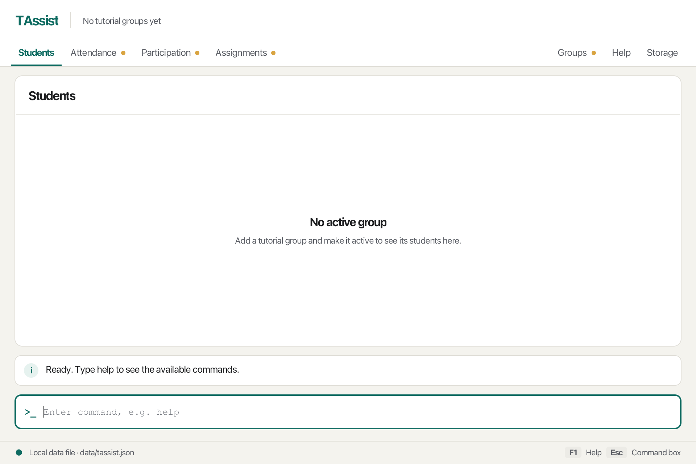

TAssist is a **desktop application for CS2040S teaching assistants, optimized for typing commands**.
The Students screen shows the students in your active tutorial group.
Commands for tutorial groups, students, attendance, participation, and assignments are **coming soon**.

* Table of Contents
{:toc}

--------------------------------------------------------------------------------------------------------------------

## Quick start

1. Ensure that Java `25` is installed on your computer.<br>
   **Mac users:** Ensure you have the precise JDK version prescribed [here](https://se-education.org/guides/tutorials/javaInstallationMac.html).

1. Download the latest `.jar` file from the [team releases page](https://github.com/AY2627S1-CS2103T-T12-4/tp/releases), when available.
   If no release is available yet, build the project with `./gradlew shadowJar` and use `build/libs/tassist.jar`.

1. Copy the file to the folder you want to use as the _home folder_ for TAssist.

1. Open a terminal, `cd` to the folder containing the JAR file, and run `java -jar tassist.jar`.<br>
   A GUI similar to the one below should appear in a few seconds. On the first launch, TAssist starts with no data.<br>
   

1. Type a command in the command box and press Enter to execute it. For example, type **`help`** and press Enter to open the command reference.<br>
   Some example commands you can try:

   * `help` : Opens the command reference.

   * `view attendance` : Opens the Attendance screen.

   * `exit` : Exits the app.

1. Refer to the [Features](#features) section below for details of each command.

--------------------------------------------------------------------------------------------------------------------

## Using the workspace

The bar at the top shows the **tutorial groups** next to the TAssist name, with the active group highlighted, and
the **screens** below it. **Students**, **Attendance**, **Participation**, and **Assignments** are on the left;
**Groups**, **Help**, and **Storage** are on the right. A small orange dot marks a screen that is still **coming soon**.
Hover over a screen, or over a shortened group name, to see more. The tooltip of a screen names the command that does
the same, such as `view attendance`.

Use the `view` command to open the same screens by typing. The command box and feedback remain visible on every screen.
Press **Escape** to return focus to the command box, or **F1** to open Help. Clicking a screen keeps your cursor in
the command box.

* **Students** is titled with the name of the active tutorial group and the number of students in it, and lists the
  students with their names and student IDs. It updates as soon as the active group or its students change. When there are no students to list, the screen says whether no group is
  active or the active group has no students yet. Hover over a shortened name to read it in full, and scroll to see
  more students.
* **Groups**, **Attendance**, **Participation**, and **Assignments** show the planned layouts with a **Coming soon**
  label. They contain no simulated records. Week controls are unavailable, and their domain commands are not yet
  supported.
* **Help** provides an offline reference for currently supported commands. The `help` command opens it.
* **Storage** shows the configured local JSON file and explains automatic saving.

The feedback row below the screen tells you whether your last command worked: a check mark means it did, and a cross
on a red background means it failed. It grows to fit the message, up to six lines; only longer messages need
scrolling. The failed input stays in the
command box so you can correct it. A command stays on the current screen unless it opens another one, as `view` and
`help` do. Screen contents can be scrolled. Smaller windows use a compact layout.
The footer shows the local file path, reports successful saves or command failures, and reminds you of the F1 and
Escape shortcuts.
Opening a screen with `view` does not save or change data.

## Features

<div markdown="block" class="alert alert-info">

**:information_source: Notes about the command format:**<br>

* Words in `UPPER_CASE` are the parameters to be supplied by the user.<br>
  For example, in `view SCREEN`, replace `SCREEN` with a screen name such as `attendance`.

* Items in square brackets are optional.<br>
  For example, `help [TOPIC]` can be used as `help student` or as `help`.

* Extraneous parameters for commands that take no parameters, such as `exit`, are ignored.<br>
  For example, `exit 123` is interpreted as `exit`.

* Leading and trailing spaces around a command are ignored. Unknown commands identify the unrecognized keyword
  and suggest entering `help`. They do not change or save your data. Tutorial-group, student, attendance,
  participation, and assignment commands remain **Coming soon**.

* If you are using a PDF version of this document, be careful when copying and pasting commands that span multiple lines as space characters surrounding line-breaks may be omitted when copied over to the application.
</div>

### Viewing help: `help`

Opens the **Help** screen, which lists the format and examples of every available command.
The feedback box confirms with `Showing the command reference.`

Format: `help [TOPIC]`

* `TOPIC` is one of `group`, `student`, `attendance`, `participation`, or `assignment`. It is not case-sensitive.
* With a `TOPIC`, the Help screen opens at that topic's commands, for example `Showing student commands.`
  If no command of that topic exists yet, TAssist says so and opens the Help screen from the top.
* An unknown topic shows `Unknown help topic. Available topics: group, student, attendance, participation, assignment.`
  and does not change any data.

Examples:
* `help`
* `help student`


### Opening a screen: `view`

Format: `view SCREEN`

`SCREEN` is one of `students`, `groups`, `attendance`, `participation`, `assignments`, `help`, or `storage`.
Screen names ignore case. Specify exactly one screen name. Opening a screen does not change any data.
An unknown screen name reports `Unknown screen` and lists the valid names. Missing or multiple screen names report
an invalid command format and show the expected syntax.

Examples: `view students`, `view attendance`, `view storage`.

### Exiting the program: `exit`

Exits the program.

Format: `exit`

### Saving the data

TAssist saves your tutorial groups, their students, and the active group after successful commands, except `view`,
which only changes the visible screen. You do not need to save manually. A failed command does not indicate a
successful save; read the feedback.

### Editing the data file

TAssist data is saved as `data/tassist.json` relative to the folder from which you launch TAssist.
The Storage screen shows the absolute path. Close the app before editing this JSON file manually.
If the file is missing, TAssist starts with no data and creates the file after the first successful command
other than `view`.

The file looks like this:

```json
{
  "activeGroup" : "T01",
  "groups" : [ {
    "name" : "T01",
    "students" : [ {
      "name" : "Alice Tan",
      "studentId" : "A0123456X"
    } ]
  } ]
}
```

* `activeGroup` is the name of the active group, or `null` if no group is active. It must match the name of one of
  the groups, ignoring case.
* Each group needs a `name`. No two groups may have the same name, ignoring case.
* Each student needs a `name` and a `studentId`. No two students in a group may have the same student ID, ignoring
  case.
* Group names, student names, and student IDs follow the same rules as when you type them in a command.

<div markdown="span" class="alert alert-warning">:exclamation: **Caution:**
If your changes make the data file invalid, TAssist starts with no data at the next run, and the terminal and the log file `tassist.log.0` say why the file could not be read. The invalid file remains on disk until a successful command other than `view` saves over it, so close TAssist and fix the file before entering such a command. We recommend backing up the file before editing it.
</div>

### Archiving data files `[coming in v2.0]`

_Details coming soon ..._

--------------------------------------------------------------------------------------------------------------------

## FAQ

**Q**: How do I transfer my data to another computer?<br>
**A**: Install the app on the other computer, then copy `data/tassist.json` from your previous TAssist home folder into the `data` folder of the new home folder.

--------------------------------------------------------------------------------------------------------------------

## Known issues

1. **When using multiple screens**, if you move the application to a secondary screen, and later switch to using only the primary screen, the GUI will open off-screen. The remedy is to delete the `preferences.json` file created by the application before running the application again.

--------------------------------------------------------------------------------------------------------------------

## Command summary

Action | Format, Examples
--------|------------------
**Help** | `help [TOPIC]`<br> e.g., `help student`
**View** | `view SCREEN`<br> e.g., `view attendance`
**Exit** | `exit`
