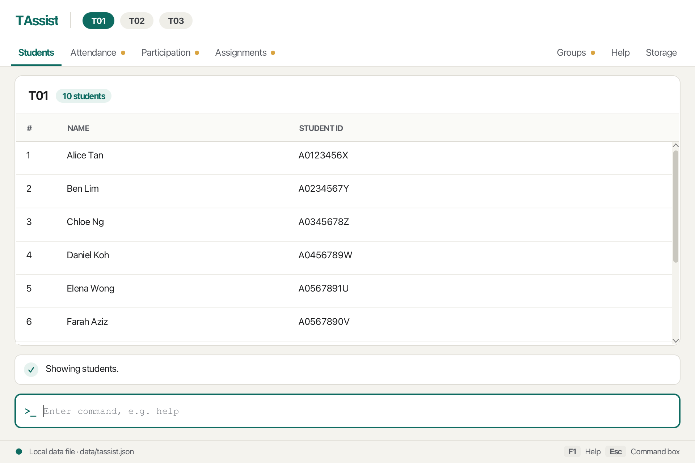

**TAssist is a desktop application for CS2040S teaching assistants to track tutorial attendance, class participation, and assignment submissions across their tutorial groups.** While it has a GUI, most of the user interactions happen using a CLI (Command Line Interface), so a TA who types fast can record a whole tutorial live.

* If you are interested in using TAssist, head over to the [_Quick Start_ section of the **User Guide**](UserGuide.html#quick-start).
* If you are interested in developing TAssist, the [**Developer Guide**](DeveloperGuide.html) is a good place to start.

**Acknowledgements**

* This project is based on the [AddressBook-Level3](https://github.com/se-edu/addressbook-level3) project created by the [SE-EDU initiative](https://se-education.org)
* Libraries used: [JavaFX](https://openjfx.io/), [Jackson](https://github.com/FasterXML/jackson), [JUnit5](https://github.com/junit-team/junit5)
